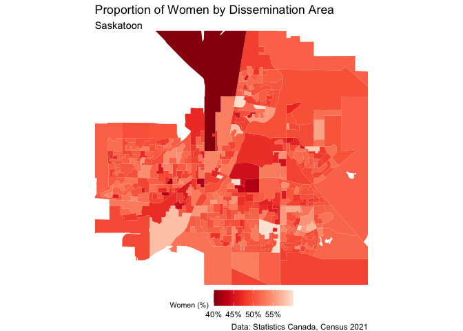
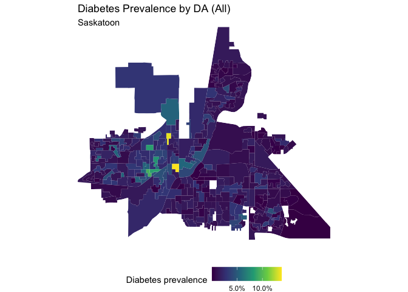
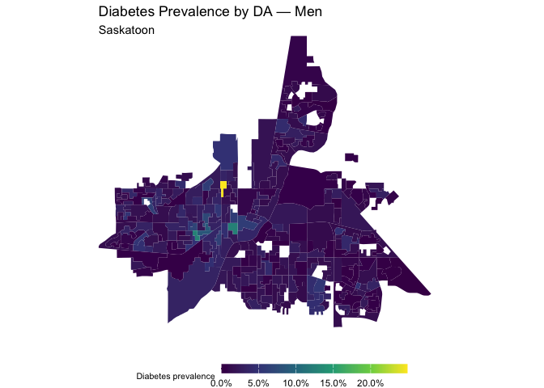
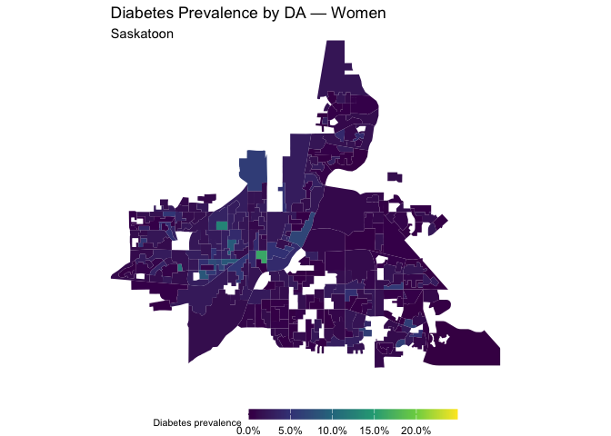
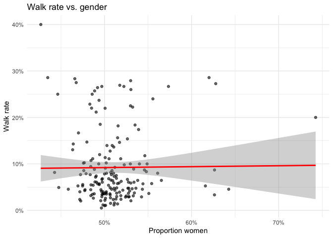
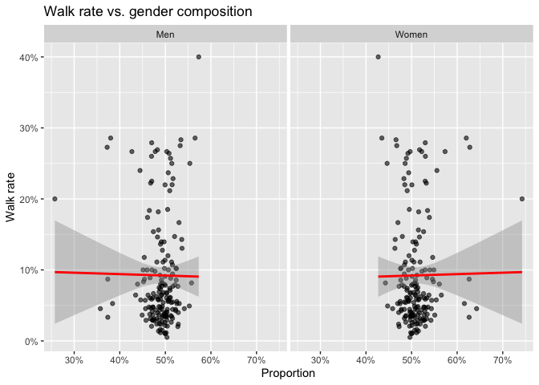
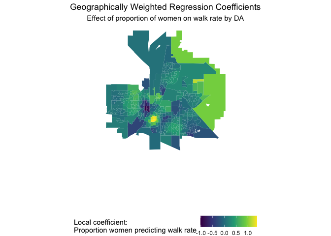

---
output:
  html_document:
    keep_md: true
---

# PLOS in Saskatoon - Gender-based analysis and Correlation with Diabetes

## 1. Gender proportion by DA


``` r
library(cancensus)
library(dplyr)
```

```
## 
## Attaching package: 'dplyr'
```

```
## The following objects are masked from 'package:stats':
## 
##     filter, lag
```

```
## The following objects are masked from 'package:base':
## 
##     intersect, setdiff, setequal, union
```

``` r
library(sf)
```

```
## Linking to GEOS 3.13.0, GDAL 3.8.5, PROJ 9.5.1; sf_use_s2() is TRUE
```

``` r
library(stringr)
library(purrr)
library(RColorBrewer)
library(ggplot2)
library(scales)
```

```
## 
## Attaching package: 'scales'
```

```
## The following object is masked from 'package:purrr':
## 
##     discard
```

``` r
library(readxl)
library(tidyr)
library(stats)

dataset <- "CA21"
```

No vectors with only gender or gender at DA-level, so I will add up the men/women age groups. 


``` r
vecs <- c(
  total      = "v_CA21_1",
  men_0_14  = "v_CA21_12",
  fem_0_14   = "v_CA21_13",
  men_15_64 = "v_CA21_69",
  fem_15_64  = "v_CA21_70",
  men_65p   = "v_CA21_252",
  fem_65p    = "v_CA21_253"
)
```


``` r
gender_da_raw <- get_census(
  dataset    = "CA21",
  regions    = list(CMA = "47725"),
  level      = "DA",
  vectors    = unname(vecs),
  geo_format = NA, # only data frame
  use_cache  = TRUE
)
```

```
## Reading vectors data from local cache.
```

Standardizing names to raw vector IDs (since the actual vector names are longer and turns up an error) -> dropping the labels after the colon. 


``` r
gender_da_std <- gender_da_raw %>%
  rename(DAUID = GeoUID) %>%
  rename_with(~ sub("^((v_CA21_\\d+)).*$", "\\1", .x))
```

Building totals & proportions:


``` r
gender_da <- gender_da_std %>%
  transmute(
    DAUID       = as.character(DAUID),
    total       = as.numeric(.data[[vecs["total"]]]),
    men_total  = as.numeric(.data[[vecs["men_0_14"]]])  +
                  as.numeric(.data[[vecs["men_15_64"]]]) +
                  as.numeric(.data[[vecs["men_65p"]]]),
    fem_total   = as.numeric(.data[[vecs["fem_0_14"]]])   +
                  as.numeric(.data[[vecs["fem_15_64"]]])  +
                  as.numeric(.data[[vecs["fem_65p"]]])
  ) %>%
  mutate(
    prop_men   = if_else(total > 0, men_total / total, NA_real_),
    prop_women = if_else(total > 0, fem_total  / total, NA_real_)
  )

gender_da
```

```
## # A tibble: 449 × 6
##    DAUID    total men_total fem_total prop_men prop_women
##    <chr>    <dbl>     <dbl>     <dbl>    <dbl>      <dbl>
##  1 47110021   720       360       350    0.5        0.486
##  2 47110022   344       160       180    0.465      0.523
##  3 47110027   519       260       265    0.501      0.511
##  4 47110028   397       220       180    0.554      0.453
##  5 47110029   364       185       190    0.508      0.522
##  6 47110030   595       290       305    0.487      0.513
##  7 47110031   492       255       235    0.518      0.478
##  8 47110032   236       120       125    0.508      0.530
##  9 47110033   437       195       245    0.446      0.561
## 10 47110035   418       195       220    0.467      0.526
## # ℹ 439 more rows
```

Summary of gender by DA:


``` r
summary(gender_da$prop_women)
```

```
##    Min. 1st Qu.  Median    Mean 3rd Qu.    Max.    NA's 
##  0.2036  0.4866  0.5025  0.5037  0.5187  0.7425       4
```

``` r
summary(gender_da$prop_men)
```

```
##    Min. 1st Qu.  Median    Mean 3rd Qu.    Max.    NA's 
##  0.2552  0.4806  0.4982  0.4968  0.5147  0.8044       4
```

## 2. Mapping gender by DA


``` r
# plos code
ped_path <- "/Users/patysalazar/Desktop/MSc/PLOS/plos/required_files/Saskatoon_ped_1.shp"
da_path <- "/Users/patysalazar/Desktop/MSc/PLOS/plos/required_files/lda_000b21a_e/lda_000b21a_e.shp"

ped <- st_read(ped_path, quiet = TRUE)
da_poly <- st_read(da_path, quiet = TRUE) |>
  select(DAUID, PRUID, geometry) |>
  filter(PRUID == "47")  

ped <- st_transform(ped, crs = 3857) 
da_poly <- st_transform(da_poly, crs = 3857)

ped <- ped |>
  mutate(
    Walk_Width = ifelse(Walk_Width %in% c("99999", 99999, "<Null>"), NA, Walk_Width) |> as.numeric(),
    Walk_Mater = ifelse(Walk_Mater %in% c("<Null>", "0", 0, "9", 9), NA, Walk_Mater) |> as.integer()
  )

score_type <- function(x){
  case_when(
    x == "Walkway"  ~ 3,
    x == "Separate" ~ 3,
    x == "Pathway"  ~ 2,
    x == "Combined" ~ 1,
    TRUE            ~ 1
  )
}

score_width <- function(w){
  case_when(
    is.na(w)  ~ 0,
    w <  1    ~ 0,
    w <  1.5  ~ 1,
    w <  2.5  ~ 2,
    w <  3    ~ 3,
    TRUE      ~ 4
  )
}

score_material <- function(c){
  case_when(
    c %in% c(1, 2, 10) ~ 3,            
    c %in% c(3, 4)     ~ 2,            
    c %in% c(5, 7)     ~ 1,            
    c == 6 | is.na(c)  ~ 0,            
    TRUE               ~ 0
  )
}

ped_scored <- ped |>
  mutate(
    sc_type  = score_type(Walk_Type_),           
    sc_width = score_width(Walk_Width),
    sc_mat   = score_material(Walk_Mater),
    q_score  = sc_type + sc_width + sc_mat,      
    seg_km   = SHAPE_Leng / 1000,                
    wtd_val  = q_score * seg_km,
    density  = wtd_val / (LANDAREA)        
  )

da_scores <- ped_scored |>
  st_drop_geometry() |>
  group_by(DAUID) |>
  summarise(plos_density = sum(density, na.rm = TRUE), .groups = "drop")
```

DA IDs used in PLOS analysis


``` r
keep_ids <- as.character(unique(da_scores$DAUID))
```

Getting DA polygons from Saskatoon CMA


``` r
das_cma_raw <- get_census(
  dataset    = "CA21",
  regions    = list(CMA = "47725"),
  level      = "DA",
  geo_format = "sf",
  use_cache  = TRUE
)
```

```
## Reading geo data from local cache.
```


``` r
names(das_cma_raw)
```

```
##  [1] "Shape Area"    "Type"          "Households"    "Quality Flags"
##  [5] "name"          "GeoUID"        "CSD_UID"       "Population"   
##  [9] "CT_UID"        "Dwellings"     "CD_UID"        "CMA_UID"      
## [13] "geometry"
```

Target CRS = whatever ped is in (3857) -> aligning CRS


``` r
target_crs <- st_crs(ped)
```

Make sure the DA layer is in the same CRS


``` r
das_cma <- das_cma_raw %>%
  mutate(DAUID = as.character(.data[["GeoUID"]])) |>
  st_transform(target_crs)
```

Keep only DAs analyzed


``` r
das_keep <- das_cma %>% filter(DAUID %in% keep_ids)
```

Join gender proportions 


``` r
gender_keep <- das_keep %>%
  left_join(gender_da, by = "DAUID") %>%
  st_transform(target_crs)
```

Build bbox from the ped layer


``` r
bbox_sask_sf <- st_as_sfc(st_bbox(ped))  
```

Crop


``` r
gender_keep <- st_make_valid(gender_keep) # fix any invalid geometries
gender_keep <- st_crop(gender_keep, bbox_sask_sf)
```

```
## Warning: attribute variables are assumed to be spatially constant throughout
## all geometries
```

Plot 


``` r
gender_da_map <- ggplot(gender_keep) +
  geom_sf(aes(fill = prop_women), color = NA) +
  scale_fill_distiller(
    type = "div", palette = "Reds", direction = -1,
    limits = c(0.40, 0.60), oob = squish,
    labels = percent_format(accuracy = 1),
    name = "Women (%)",
    na.value = "white"
  ) +
  coord_sf(xlim = st_bbox(ped)[c("xmin","xmax")],
           ylim = st_bbox(ped)[c("ymin","ymax")],
           expand = FALSE) +
  labs(title = "Proportion of Women by Dissemination Area",
       subtitle = "Saskatoon",
       caption = "Data: Statistics Canada, Census 2021") +
  theme_void() +
  theme(legend.position = "bottom",
        legend.title = element_text(size=8))

gender_da_map
```

<!-- -->

``` r
ggsave("/Users/patysalazar/Desktop/Methods Café/Final Paper/plos_project/maps/gender_da_map.png",
       plot = gender_da_map, width = 8, height = 6, dpi = 300,
       bg = "white")
```

## 3. Mapping diabetes data (by DA and gender)


``` r
health_data_path <- "/Users/patysalazar/Desktop/Methods Café/Final Paper/plos_project/required_files/Raw data for hospitalizations_for_Paty.xlsx"
```

Renaming variables


``` r
health_data <- read_excel(
  path = health_data_path,
  sheet = "Diabetes"  
) %>%
  mutate(
    da = as.character(da),
    DAUID = da,
    gender_display = recode(gender,
                            "Male"   = "men",
                            "Female" = "women")
  )

names(health_data)
```

```
##  [1] "year"                     "discharge"               
##  [3] "gender"                   "age"                     
##  [5] "10_yr_groupings"          "registered_indian_status"
##  [7] "pcode"                    "neighbourhood_number"    
##  [9] "neighbourhood_name"       "disparity_nhd_type"      
## [11] "da"                       "Total Dep Local"         
## [13] "SumOfseps"                "MRD"                     
## [15] "DAUID"                    "gender_display"
```


Overall cases by DA


``` r
cases_da <- health_data %>%
  group_by(DAUID) %>%
  summarise(cases_all = n())

cases_da_gender <- health_data %>%
  filter(gender_display %in% c("men","women")) %>%
  count(DAUID, gender = gender_display, name = "cases") %>%
  ungroup()
```

Overall denominator for prevalence (per DA)


``` r
den_all <- gender_da %>% select(DAUID, pop_all = total)
```

Gender-specific denominator for prevalence (per DA)


``` r
den_gender <- gender_da %>%
  transmute(
    DAUID,
    men   = men_total,
    women = fem_total
  ) %>%
  pivot_longer(c(men, women), names_to="gender", values_to="pop")
```

Overall prevalence by DA


``` r
prev_da <- cases_da %>%
  left_join(den_all, by = "DAUID") %>%
  mutate(prev_all = if_else(pop_all > 0, cases_all / pop_all, NA_real_))

prev_da
```

```
## # A tibble: 344 × 4
##    DAUID    cases_all pop_all prev_all
##    <chr>        <int>   <dbl>    <dbl>
##  1 47110021        10     720  0.0139 
##  2 47110022         2     344  0.00581
##  3 47110027         3     519  0.00578
##  4 47110028         3     397  0.00756
##  5 47110029         2     364  0.00549
##  6 47110030         3     595  0.00504
##  7 47110031         7     492  0.0142 
##  8 47110032         3     236  0.0127 
##  9 47110033         3     437  0.00686
## 10 47110035        17     418  0.0407 
## # ℹ 334 more rows
```

Gender-specific prevalence by DA


``` r
prev_da_gender <- cases_da_gender %>%
  left_join(den_gender, by = c("DAUID","gender")) %>%
  mutate(prev = if_else(pop > 0, cases / pop, NA_real_))

prev_da_gender
```

```
## # A tibble: 620 × 5
##    DAUID    gender cases   pop    prev
##    <chr>    <chr>  <int> <dbl>   <dbl>
##  1 47110021 men        3   360 0.00833
##  2 47110021 women      7   350 0.02   
##  3 47110022 women      2   180 0.0111 
##  4 47110027 men        3   260 0.0115 
##  5 47110028 women      3   180 0.0167 
##  6 47110029 men        2   185 0.0108 
##  7 47110030 men        2   290 0.00690
##  8 47110030 women      1   305 0.00328
##  9 47110031 women      7   235 0.0298 
## 10 47110032 men        3   120 0.025  
## # ℹ 610 more rows
```

Joining datasets by DA


``` r
da_diabetes <- das_keep %>%
  left_join(health_data, by = "DAUID") 
```

Overall prevalence map


``` r
da_diabetes_all <- das_keep %>%
  left_join(prev_da, by = "DAUID")

da_diabetes_plot <- ggplot(da_diabetes_all) +
  geom_sf(aes(fill = prev_all), color = NA) +
  scale_fill_viridis_c(labels = percent_format(accuracy = 0.1),
                       name = "Diabetes prevalence",
                       na.value = "white") +
  coord_sf(
    xlim = st_bbox(ped)[c("xmin","xmax")],
    ylim = st_bbox(ped)[c("ymin","ymax")],
    expand = FALSE
  ) +
  labs(title = "Diabetes Prevalence by DA (All)",
       subtitle = "Saskatoon") +
  theme_void() + theme(legend.position = "bottom")

ggsave("/Users/patysalazar/Desktop/Methods Café/Final Paper/plos_project/maps/diabetes_da_map.png",
       plot = da_diabetes_plot, width = 8, height = 6, dpi = 300,
       bg = "white")

da_diabetes_plot
```

<!-- -->

Gender-specific maps

Splitting into 2 datasets


``` r
# keep only men/women rows from gender-specific prevalence sf
da_diabetes_gender <- das_keep %>%                # <-- sf with geometry
  left_join(prev_da_gender, by = "DAUID") %>% # attach prev + gender
  st_make_valid()     

# common limits across both maps 
lims <- range(da_diabetes_gender$prev, na.rm = TRUE)
lims[1] <- 0
lims[2] <- max(lims[2], 0.15)   # 15% cap

# split
da_diabetes_men   <- da_diabetes_gender %>% filter(gender == "men")
da_diabetes_women <- da_diabetes_gender %>% filter(gender == "women")
```

Men map (diabetes by DA)


``` r
p_men <- ggplot(da_diabetes_men) +
  geom_sf(aes(fill = prev), color = NA) +
  scale_fill_viridis_c(
    limits = lims, oob = squish,
    labels = percent_format(accuracy = 0.1),
    name = "Diabetes prevalence",
    na.value = "white"  
  ) +
  guides(fill = guide_colorbar(barheight = 0.6, barwidth = 12)) +
  coord_sf(
    xlim = st_bbox(ped)[c("xmin","xmax")],
    ylim = st_bbox(ped)[c("ymin","ymax")],
    expand = FALSE
  ) +
  labs(
    title = "Diabetes Prevalence by DA — Men",
    subtitle = "Saskatoon"
  ) +
  theme_void() +
  theme(legend.position = "bottom",
        legend.title = element_text(size = 8))

print(p_men)
```

<!-- -->

``` r
ggsave("/Users/patysalazar/Desktop/Methods Café/Final Paper/plos_project/maps/men_diabetes_da_map.png",
       plot = p_men, width = 8, height = 6, dpi = 300,
       bg = "white")
```

Women map (diabetes by DA)


``` r
p_women <- ggplot(da_diabetes_women) +
  geom_sf(aes(fill = prev), color = NA) +
  scale_fill_viridis_c(
    limits = lims, oob = squish,
    labels = percent_format(accuracy = 0.1),
    name = "Diabetes prevalence",
    na.value = "white"
  ) +
  guides(fill = guide_colorbar(barheight = 0.6, barwidth = 12)) +
  coord_sf(
    xlim = st_bbox(ped)[c("xmin","xmax")],
    ylim = st_bbox(ped)[c("ymin","ymax")],
    expand = FALSE
  ) +
  labs(
    title = "Diabetes Prevalence by DA — Women",
    subtitle = "Saskatoon"
  ) +
  theme_void() +
  theme(legend.position = "bottom",
        legend.title = element_text(size = 8))

print(p_women)
```

<!-- -->

``` r
ggsave("/Users/patysalazar/Desktop/Methods Café/Final Paper/plos_project/maps/women_diabetes_da_map.png",
       plot = p_women, width = 8, height = 6, dpi = 300,
       bg = "white")
```


## 4. Correlation analysis


``` r
# walk scores code
final_data_path <- "/Users/patysalazar/Desktop/MSc/PLOS/plos/required_files/FINAL.xlsx"

final_scores <- read_excel(final_data_path) |>
  mutate(DAUID = as.character(DAUID))

names(final_scores)
```

```
## [1] "DAUID"        "plos_density" "plos_class"   "walk_rate"
```

Analysis data frame


``` r
analysis_df <- final_scores %>%               
  select(DAUID, walk_rate, plos_density) %>%
  left_join(gender_da %>% select(DAUID, prop_women, total), by = "DAUID") %>%
  left_join(prev_da %>% select(DAUID, prev_all), by = "DAUID") %>%  
  mutate(
    plos_z        = as.numeric(scale(plos_density)),
    women_pct     = prop_women * 100
  )
summary(analysis_df)
```

```
##     DAUID             walk_rate        plos_density         prop_women    
##  Length:371         Min.   :0.00000   Min.   :  0.05955   Min.   :0.2036  
##  Class :character   1st Qu.:0.00000   1st Qu.:140.48819   1st Qu.:0.4886  
##  Mode  :character   Median :0.00000   Median :181.99911   Median :0.5046  
##                     Mean   :0.04428   Mean   :167.63210   Mean   :0.5063  
##                     3rd Qu.:0.06061   3rd Qu.:208.61714   3rd Qu.:0.5216  
##                     Max.   :0.40000   Max.   :275.64679   Max.   :0.7425  
##                                                           NA's   :2       
##      total           prev_all            plos_z          women_pct    
##  Min.   :   0.0   Min.   :0.000119   Min.   :-2.8900   Min.   :20.36  
##  1st Qu.: 425.0   1st Qu.:0.007509   1st Qu.:-0.4681   1st Qu.:48.86  
##  Median : 508.0   Median :0.013444   Median : 0.2478   Median :50.46  
##  Mean   : 720.0   Mean   :0.018506   Mean   : 0.0000   Mean   :50.63  
##  3rd Qu.: 678.5   3rd Qu.:0.024436   3rd Qu.: 0.7068   3rd Qu.:52.16  
##  Max.   :9273.0   Max.   :0.138211   Max.   : 1.8628   Max.   :74.25  
##                   NA's   :45                           NA's   :2
```

Correlation walk rate & plos


``` r
cor(final_scores$plos_density, final_scores$walk_rate)
```

```
## [1] 0.1534923
```

Small positive correlation -> areas with better pedestrian infrastructure tend to have slightly higher walk rates, but it's weak.

Correlation walk rate & gender


``` r
cor(analysis_df$prop_women, analysis_df$walk_rate, use = "complete.obs")
```

```
## [1] 0.07866567
```

Weak correlation: 0.079.

Walk rate ~ gender model 


``` r
# unweigthed
m0 <- lm(walk_rate ~ prop_women, data = analysis_df)
summary(m0)
```

```
## 
## Call:
## lm(formula = walk_rate ~ prop_women, data = analysis_df)
## 
## Residuals:
##      Min       1Q   Median       3Q      Max 
## -0.07017 -0.04416 -0.03666  0.01474  0.36733 
## 
## Coefficients:
##             Estimate Std. Error t value Pr(>|t|)
## (Intercept) -0.03095    0.05006  -0.618    0.537
## prop_women   0.14905    0.09860   1.512    0.131
## 
## Residual standard error: 0.07081 on 367 degrees of freedom
##   (2 observations deleted due to missingness)
## Multiple R-squared:  0.006188,	Adjusted R-squared:  0.00348 
## F-statistic: 2.285 on 1 and 367 DF,  p-value: 0.1315
```

Each 1.0 increase in the proportion of women is associated with a 0.15 increase in walk rate, but the association is not statistically significant.


``` r
# weighted by DA population
m0w <- lm(walk_rate ~ prop_women, data = analysis_df, weights = total)
summary(m0w)
```

```
## 
## Call:
## lm(formula = walk_rate ~ prop_women, data = analysis_df, weights = total)
## 
## Weighted Residuals:
##     Min      1Q  Median      3Q     Max 
## -2.3838 -0.8449 -0.5827  0.4968  6.9619 
## 
## Coefficients:
##             Estimate Std. Error t value Pr(>|t|)  
## (Intercept) -0.03932    0.04352  -0.903   0.3669  
## prop_women   0.15122    0.08531   1.773   0.0771 .
## ---
## Signif. codes:  0 '***' 0.001 '**' 0.01 '*' 0.05 '.' 0.1 ' ' 1
## 
## Residual standard error: 1.656 on 367 degrees of freedom
##   (2 observations deleted due to missingness)
## Multiple R-squared:  0.008489,	Adjusted R-squared:  0.005788 
## F-statistic: 3.142 on 1 and 367 DF,  p-value: 0.07712
```

Slightly stronger when weighted by population, suggesting that larger DAs might show a clearer relationship between gender composition and walk rate. Almost statistically significant. 

Model without walk rate = 0


``` r
analysis_clean <- analysis_df %>%
  filter(
    walk_rate > 0,               
    !is.na(walk_rate),
    !is.na(prop_women),
    prop_women > 0 & prop_women < 1
  )
```


``` r
# unweigthed
m0 <- lm(walk_rate ~ prop_women, data = analysis_clean)
summary(m0)
```

```
## 
## Call:
## lm(formula = walk_rate ~ prop_women, data = analysis_clean)
## 
## Residuals:
##      Min       1Q   Median       3Q      Max 
## -0.08691 -0.05293 -0.03029  0.01887  0.30939 
## 
## Coefficients:
##             Estimate Std. Error t value Pr(>|t|)
## (Intercept)  0.08208    0.08042   1.021    0.309
## prop_women   0.01998    0.15705   0.127    0.899
## 
## Residual standard error: 0.07786 on 176 degrees of freedom
## Multiple R-squared:  9.192e-05,	Adjusted R-squared:  -0.005589 
## F-statistic: 0.01618 on 1 and 176 DF,  p-value: 0.8989
```

``` r
# weighted by DA population
m0w <- lm(walk_rate ~ prop_women, data = analysis_clean, weights = total)
summary(m0w)
```

```
## 
## Call:
## lm(formula = walk_rate ~ prop_women, data = analysis_clean, weights = total)
## 
## Weighted Residuals:
##     Min      1Q  Median      3Q     Max 
## -4.6962 -0.5558  0.0038  1.0334  6.2490 
## 
## Coefficients:
##             Estimate Std. Error t value Pr(>|t|)
## (Intercept) 0.007613   0.075769   0.100    0.920
## prop_women  0.105913   0.147528   0.718    0.474
## 
## Residual standard error: 2.09 on 176 degrees of freedom
## Multiple R-squared:  0.00292,	Adjusted R-squared:  -0.002745 
## F-statistic: 0.5154 on 1 and 176 DF,  p-value: 0.4738
```


Scatterplot


``` r
ggplot(analysis_df, aes(x = prop_women, y = walk_rate)) +
  geom_point(alpha = 0.6) +
  geom_smooth(method = "lm", se = TRUE, color = "red") +
  scale_x_continuous(labels = percent_format(accuracy = 1)) +
  scale_y_continuous(labels = percent_format(accuracy = 1)) +
  labs(
    x = "Women proportion",
    y = "Walk rate",
    title = "Walk rate vs. gender by DA-level (Saskatoon)"
  ) +
  theme_minimal()
```

```
## `geom_smooth()` using formula = 'y ~ x'
```

```
## Warning: Removed 2 rows containing non-finite outside the scale range
## (`stat_smooth()`).
```

```
## Warning: Removed 2 rows containing missing values or values outside the scale range
## (`geom_point()`).
```

<!-- -->

New scatterplot (removing invalid walking rate values - outliers)


``` r
ggplot(analysis_clean, aes(x = prop_women, y = walk_rate)) +
  geom_point(alpha = 0.6) +
  geom_smooth(method = "lm", se = TRUE, color = "red") +
  scale_x_continuous(labels = percent_format(accuracy = 1)) +
  scale_y_continuous(labels = percent_format(accuracy = 1)) +
  labs(
    x = "Proportion women",
    y = "Walk rate",
    title = "Walk rate vs. gender"
  ) +
  theme_minimal()
```

```
## `geom_smooth()` using formula = 'y ~ x'
```

<!-- -->

Faceted scatterplot with men proportion


``` r
# creating dataframe
analysis_clean2 <- analysis_clean %>%
  mutate(
    prop_men = 1 - prop_women
  ) %>%
  select(DAUID, walk_rate, prop_women, prop_men) %>%
  pivot_longer(
    cols = c(prop_women, prop_men),
    names_to = "gender",
    values_to = "proportion"
  ) %>%
  mutate(
    gender = recode(gender,
                    "prop_women" = "Women",
                    "prop_men" = "Men")
  )

# plot
facet_plot <- ggplot(analysis_clean2, aes(x = proportion, y = walk_rate)) +
  geom_point(alpha = 0.6) +
  geom_smooth(method = "lm", se = TRUE, color = "red") +
  scale_x_continuous(labels = percent_format(accuracy = 1)) +
  scale_y_continuous(labels = percent_format(accuracy = 1)) +
  facet_wrap(~ gender) +
  labs(
    title = "Walk rate vs. gender composition",
    x = "Proportion",
    y = "Walk rate"
  ) +
  theme(
    panel.spacing.x = unit(0.2, "lines")
  )
  theme_minimal()
```

```
## <theme> List of 144
##  $ line                            : <ggplot2::element_line>
##   ..@ colour       : chr "black"
##   ..@ linewidth    : num 0.5
##   ..@ linetype     : num 1
##   ..@ lineend      : chr "butt"
##   ..@ linejoin     : chr "round"
##   ..@ arrow        : logi FALSE
##   ..@ arrow.fill   : chr "black"
##   ..@ inherit.blank: logi TRUE
##  $ rect                            : <ggplot2::element_rect>
##   ..@ fill         : chr "white"
##   ..@ colour       : chr "black"
##   ..@ linewidth    : num 0.5
##   ..@ linetype     : num 1
##   ..@ linejoin     : chr "round"
##   ..@ inherit.blank: logi TRUE
##  $ text                            : <ggplot2::element_text>
##   ..@ family       : chr ""
##   ..@ face         : chr "plain"
##   ..@ italic       : chr NA
##   ..@ fontweight   : num NA
##   ..@ fontwidth    : num NA
##   ..@ colour       : chr "black"
##   ..@ size         : num 11
##   ..@ hjust        : num 0.5
##   ..@ vjust        : num 0.5
##   ..@ angle        : num 0
##   ..@ lineheight   : num 0.9
##   ..@ margin       : <ggplot2::margin> num [1:4] 0 0 0 0
##   ..@ debug        : logi FALSE
##   ..@ inherit.blank: logi TRUE
##  $ title                           : <ggplot2::element_text>
##   ..@ family       : NULL
##   ..@ face         : NULL
##   ..@ italic       : chr NA
##   ..@ fontweight   : num NA
##   ..@ fontwidth    : num NA
##   ..@ colour       : NULL
##   ..@ size         : NULL
##   ..@ hjust        : NULL
##   ..@ vjust        : NULL
##   ..@ angle        : NULL
##   ..@ lineheight   : NULL
##   ..@ margin       : NULL
##   ..@ debug        : NULL
##   ..@ inherit.blank: logi TRUE
##  $ point                           : <ggplot2::element_point>
##   ..@ colour       : chr "black"
##   ..@ shape        : num 19
##   ..@ size         : num 1.5
##   ..@ fill         : chr "white"
##   ..@ stroke       : num 0.5
##   ..@ inherit.blank: logi TRUE
##  $ polygon                         : <ggplot2::element_polygon>
##   ..@ fill         : chr "white"
##   ..@ colour       : chr "black"
##   ..@ linewidth    : num 0.5
##   ..@ linetype     : num 1
##   ..@ linejoin     : chr "round"
##   ..@ inherit.blank: logi TRUE
##  $ geom                            : <ggplot2::element_geom>
##   ..@ ink        : chr "black"
##   ..@ paper      : chr "white"
##   ..@ accent     : chr "#3366FF"
##   ..@ linewidth  : num 0.5
##   ..@ borderwidth: num 0.5
##   ..@ linetype   : int 1
##   ..@ bordertype : int 1
##   ..@ family     : chr ""
##   ..@ fontsize   : num 3.87
##   ..@ pointsize  : num 1.5
##   ..@ pointshape : num 19
##   ..@ colour     : NULL
##   ..@ fill       : NULL
##  $ spacing                         : 'simpleUnit' num 5.5points
##   ..- attr(*, "unit")= int 8
##  $ margins                         : <ggplot2::margin> num [1:4] 5.5 5.5 5.5 5.5
##  $ aspect.ratio                    : NULL
##  $ axis.title                      : NULL
##  $ axis.title.x                    : <ggplot2::element_text>
##   ..@ family       : NULL
##   ..@ face         : NULL
##   ..@ italic       : chr NA
##   ..@ fontweight   : num NA
##   ..@ fontwidth    : num NA
##   ..@ colour       : NULL
##   ..@ size         : NULL
##   ..@ hjust        : NULL
##   ..@ vjust        : num 1
##   ..@ angle        : NULL
##   ..@ lineheight   : NULL
##   ..@ margin       : <ggplot2::margin> num [1:4] 2.75 0 0 0
##   ..@ debug        : NULL
##   ..@ inherit.blank: logi TRUE
##  $ axis.title.x.top                : <ggplot2::element_text>
##   ..@ family       : NULL
##   ..@ face         : NULL
##   ..@ italic       : chr NA
##   ..@ fontweight   : num NA
##   ..@ fontwidth    : num NA
##   ..@ colour       : NULL
##   ..@ size         : NULL
##   ..@ hjust        : NULL
##   ..@ vjust        : num 0
##   ..@ angle        : NULL
##   ..@ lineheight   : NULL
##   ..@ margin       : <ggplot2::margin> num [1:4] 0 0 2.75 0
##   ..@ debug        : NULL
##   ..@ inherit.blank: logi TRUE
##  $ axis.title.x.bottom             : NULL
##  $ axis.title.y                    : <ggplot2::element_text>
##   ..@ family       : NULL
##   ..@ face         : NULL
##   ..@ italic       : chr NA
##   ..@ fontweight   : num NA
##   ..@ fontwidth    : num NA
##   ..@ colour       : NULL
##   ..@ size         : NULL
##   ..@ hjust        : NULL
##   ..@ vjust        : num 1
##   ..@ angle        : num 90
##   ..@ lineheight   : NULL
##   ..@ margin       : <ggplot2::margin> num [1:4] 0 2.75 0 0
##   ..@ debug        : NULL
##   ..@ inherit.blank: logi TRUE
##  $ axis.title.y.left               : NULL
##  $ axis.title.y.right              : <ggplot2::element_text>
##   ..@ family       : NULL
##   ..@ face         : NULL
##   ..@ italic       : chr NA
##   ..@ fontweight   : num NA
##   ..@ fontwidth    : num NA
##   ..@ colour       : NULL
##   ..@ size         : NULL
##   ..@ hjust        : NULL
##   ..@ vjust        : num 1
##   ..@ angle        : num -90
##   ..@ lineheight   : NULL
##   ..@ margin       : <ggplot2::margin> num [1:4] 0 0 0 2.75
##   ..@ debug        : NULL
##   ..@ inherit.blank: logi TRUE
##  $ axis.text                       : <ggplot2::element_text>
##   ..@ family       : NULL
##   ..@ face         : NULL
##   ..@ italic       : chr NA
##   ..@ fontweight   : num NA
##   ..@ fontwidth    : num NA
##   ..@ colour       : chr "#4D4D4DFF"
##   ..@ size         : 'rel' num 0.8
##   ..@ hjust        : NULL
##   ..@ vjust        : NULL
##   ..@ angle        : NULL
##   ..@ lineheight   : NULL
##   ..@ margin       : NULL
##   ..@ debug        : NULL
##   ..@ inherit.blank: logi TRUE
##  $ axis.text.x                     : <ggplot2::element_text>
##   ..@ family       : NULL
##   ..@ face         : NULL
##   ..@ italic       : chr NA
##   ..@ fontweight   : num NA
##   ..@ fontwidth    : num NA
##   ..@ colour       : NULL
##   ..@ size         : NULL
##   ..@ hjust        : NULL
##   ..@ vjust        : num 1
##   ..@ angle        : NULL
##   ..@ lineheight   : NULL
##   ..@ margin       : <ggplot2::margin> num [1:4] 2.2 0 0 0
##   ..@ debug        : NULL
##   ..@ inherit.blank: logi TRUE
##  $ axis.text.x.top                 : <ggplot2::element_text>
##   ..@ family       : NULL
##   ..@ face         : NULL
##   ..@ italic       : chr NA
##   ..@ fontweight   : num NA
##   ..@ fontwidth    : num NA
##   ..@ colour       : NULL
##   ..@ size         : NULL
##   ..@ hjust        : NULL
##   ..@ vjust        : NULL
##   ..@ angle        : NULL
##   ..@ lineheight   : NULL
##   ..@ margin       : <ggplot2::margin> num [1:4] 0 0 4.95 0
##   ..@ debug        : NULL
##   ..@ inherit.blank: logi TRUE
##  $ axis.text.x.bottom              : <ggplot2::element_text>
##   ..@ family       : NULL
##   ..@ face         : NULL
##   ..@ italic       : chr NA
##   ..@ fontweight   : num NA
##   ..@ fontwidth    : num NA
##   ..@ colour       : NULL
##   ..@ size         : NULL
##   ..@ hjust        : NULL
##   ..@ vjust        : NULL
##   ..@ angle        : NULL
##   ..@ lineheight   : NULL
##   ..@ margin       : <ggplot2::margin> num [1:4] 4.95 0 0 0
##   ..@ debug        : NULL
##   ..@ inherit.blank: logi TRUE
##  $ axis.text.y                     : <ggplot2::element_text>
##   ..@ family       : NULL
##   ..@ face         : NULL
##   ..@ italic       : chr NA
##   ..@ fontweight   : num NA
##   ..@ fontwidth    : num NA
##   ..@ colour       : NULL
##   ..@ size         : NULL
##   ..@ hjust        : num 1
##   ..@ vjust        : NULL
##   ..@ angle        : NULL
##   ..@ lineheight   : NULL
##   ..@ margin       : <ggplot2::margin> num [1:4] 0 2.2 0 0
##   ..@ debug        : NULL
##   ..@ inherit.blank: logi TRUE
##  $ axis.text.y.left                : <ggplot2::element_text>
##   ..@ family       : NULL
##   ..@ face         : NULL
##   ..@ italic       : chr NA
##   ..@ fontweight   : num NA
##   ..@ fontwidth    : num NA
##   ..@ colour       : NULL
##   ..@ size         : NULL
##   ..@ hjust        : NULL
##   ..@ vjust        : NULL
##   ..@ angle        : NULL
##   ..@ lineheight   : NULL
##   ..@ margin       : <ggplot2::margin> num [1:4] 0 4.95 0 0
##   ..@ debug        : NULL
##   ..@ inherit.blank: logi TRUE
##  $ axis.text.y.right               : <ggplot2::element_text>
##   ..@ family       : NULL
##   ..@ face         : NULL
##   ..@ italic       : chr NA
##   ..@ fontweight   : num NA
##   ..@ fontwidth    : num NA
##   ..@ colour       : NULL
##   ..@ size         : NULL
##   ..@ hjust        : NULL
##   ..@ vjust        : NULL
##   ..@ angle        : NULL
##   ..@ lineheight   : NULL
##   ..@ margin       : <ggplot2::margin> num [1:4] 0 0 0 4.95
##   ..@ debug        : NULL
##   ..@ inherit.blank: logi TRUE
##  $ axis.text.theta                 : NULL
##  $ axis.text.r                     : <ggplot2::element_text>
##   ..@ family       : NULL
##   ..@ face         : NULL
##   ..@ italic       : chr NA
##   ..@ fontweight   : num NA
##   ..@ fontwidth    : num NA
##   ..@ colour       : NULL
##   ..@ size         : NULL
##   ..@ hjust        : num 0.5
##   ..@ vjust        : NULL
##   ..@ angle        : NULL
##   ..@ lineheight   : NULL
##   ..@ margin       : <ggplot2::margin> num [1:4] 0 2.2 0 2.2
##   ..@ debug        : NULL
##   ..@ inherit.blank: logi TRUE
##  $ axis.ticks                      : <ggplot2::element_blank>
##  $ axis.ticks.x                    : NULL
##  $ axis.ticks.x.top                : NULL
##  $ axis.ticks.x.bottom             : NULL
##  $ axis.ticks.y                    : NULL
##  $ axis.ticks.y.left               : NULL
##  $ axis.ticks.y.right              : NULL
##  $ axis.ticks.theta                : NULL
##  $ axis.ticks.r                    : NULL
##  $ axis.minor.ticks.x.top          : NULL
##  $ axis.minor.ticks.x.bottom       : NULL
##  $ axis.minor.ticks.y.left         : NULL
##  $ axis.minor.ticks.y.right        : NULL
##  $ axis.minor.ticks.theta          : NULL
##  $ axis.minor.ticks.r              : NULL
##  $ axis.ticks.length               : 'rel' num 0.5
##  $ axis.ticks.length.x             : NULL
##  $ axis.ticks.length.x.top         : NULL
##  $ axis.ticks.length.x.bottom      : NULL
##  $ axis.ticks.length.y             : NULL
##  $ axis.ticks.length.y.left        : NULL
##  $ axis.ticks.length.y.right       : NULL
##  $ axis.ticks.length.theta         : NULL
##  $ axis.ticks.length.r             : NULL
##  $ axis.minor.ticks.length         : 'rel' num 0.75
##  $ axis.minor.ticks.length.x       : NULL
##  $ axis.minor.ticks.length.x.top   : NULL
##  $ axis.minor.ticks.length.x.bottom: NULL
##  $ axis.minor.ticks.length.y       : NULL
##  $ axis.minor.ticks.length.y.left  : NULL
##  $ axis.minor.ticks.length.y.right : NULL
##  $ axis.minor.ticks.length.theta   : NULL
##  $ axis.minor.ticks.length.r       : NULL
##  $ axis.line                       : <ggplot2::element_blank>
##  $ axis.line.x                     : NULL
##  $ axis.line.x.top                 : NULL
##  $ axis.line.x.bottom              : NULL
##  $ axis.line.y                     : NULL
##  $ axis.line.y.left                : NULL
##  $ axis.line.y.right               : NULL
##  $ axis.line.theta                 : NULL
##  $ axis.line.r                     : NULL
##  $ legend.background               : <ggplot2::element_blank>
##  $ legend.margin                   : NULL
##  $ legend.spacing                  : 'rel' num 2
##  $ legend.spacing.x                : NULL
##  $ legend.spacing.y                : NULL
##  $ legend.key                      : <ggplot2::element_blank>
##  $ legend.key.size                 : 'simpleUnit' num 1.2lines
##   ..- attr(*, "unit")= int 3
##  $ legend.key.height               : NULL
##  $ legend.key.width                : NULL
##  $ legend.key.spacing              : NULL
##  $ legend.key.spacing.x            : NULL
##  $ legend.key.spacing.y            : NULL
##  $ legend.key.justification        : NULL
##  $ legend.frame                    : NULL
##  $ legend.ticks                    : NULL
##  $ legend.ticks.length             : 'rel' num 0.2
##  $ legend.axis.line                : NULL
##  $ legend.text                     : <ggplot2::element_text>
##   ..@ family       : NULL
##   ..@ face         : NULL
##   ..@ italic       : chr NA
##   ..@ fontweight   : num NA
##   ..@ fontwidth    : num NA
##   ..@ colour       : NULL
##   ..@ size         : 'rel' num 0.8
##   ..@ hjust        : NULL
##   ..@ vjust        : NULL
##   ..@ angle        : NULL
##   ..@ lineheight   : NULL
##   ..@ margin       : NULL
##   ..@ debug        : NULL
##   ..@ inherit.blank: logi TRUE
##  $ legend.text.position            : NULL
##  $ legend.title                    : <ggplot2::element_text>
##   ..@ family       : NULL
##   ..@ face         : NULL
##   ..@ italic       : chr NA
##   ..@ fontweight   : num NA
##   ..@ fontwidth    : num NA
##   ..@ colour       : NULL
##   ..@ size         : NULL
##   ..@ hjust        : num 0
##   ..@ vjust        : NULL
##   ..@ angle        : NULL
##   ..@ lineheight   : NULL
##   ..@ margin       : NULL
##   ..@ debug        : NULL
##   ..@ inherit.blank: logi TRUE
##  $ legend.title.position           : NULL
##  $ legend.position                 : chr "right"
##  $ legend.position.inside          : NULL
##  $ legend.direction                : NULL
##  $ legend.byrow                    : NULL
##  $ legend.justification            : chr "center"
##  $ legend.justification.top        : NULL
##  $ legend.justification.bottom     : NULL
##  $ legend.justification.left       : NULL
##  $ legend.justification.right      : NULL
##  $ legend.justification.inside     : NULL
##   [list output truncated]
##  @ complete: logi TRUE
##  @ validate: logi TRUE
```

``` r
facet_plot
```

```
## `geom_smooth()` using formula = 'y ~ x'
```

<!-- -->


Diabetes correlations


``` r
cor(analysis_df$walk_rate, analysis_df$prev_all, use = "complete.obs", method = "spearman")
```

```
## [1] 0.07684773
```

``` r
cor(analysis_df$plos_density, analysis_df$prev_all, use = "complete.obs", method = "spearman")
```

```
## [1] -0.08210738
```

## 5. Geographically weighted regression


``` r
library(spgwr)
```

```
## Loading required package: sp
```

```
## Loading required package: spData
```

```
## To access larger datasets in this package, install the spDataLarge
## package with: `install.packages('spDataLarge',
## repos='https://nowosad.github.io/drat/', type='source')`
```

```
## NOTE: This package does not constitute approval of GWR
## as a method of spatial analysis; see example(gwr)
```

Converting analysis_df to spatial df by joining to polygons


``` r
analysis_sf <- das_keep %>%
  left_join(
    analysis_df %>% select(DAUID, walk_rate, prop_women),
    by = "DAUID"
  ) %>%
  filter(!is.na(walk_rate), !is.na(prop_women)) %>%
  st_make_valid()

nrow(analysis_sf)
```

```
## [1] 369
```

Converting to spatial object 


``` r
analysis_sp <- as(analysis_sf, "Spatial")
```

Calculating kernel bandwidth 


``` r
bw <- gwr.sel(walk_rate ~ prop_women, data = analysis_sp, coords=coordinates(analysis_sp))
```

```
## Warning in gwr.sel(walk_rate ~ prop_women, data = analysis_sp, coords =
## coordinates(analysis_sp)): data is Spatial* object, ignoring coords argument
```

```
## Bandwidth: 14126.02 CV score: 1.866544 
## Bandwidth: 22833.57 CV score: 1.870313 
## Bandwidth: 8744.466 CV score: 1.829281 
## Bandwidth: 5418.48 CV score: 1.648669 
## Bandwidth: 3362.908 CV score: 1.3293 
## Bandwidth: 2092.495 CV score: 1.05136 
## Bandwidth: 1307.336 CV score: 0.8865341 
## Bandwidth: 822.0813 CV score: 0.9174051 
## Bandwidth: 1212.438 CV score: 0.8759005 
## Bandwidth: 1135.391 CV score: 0.8709163 
## Bandwidth: 1015.717 CV score: 0.872509 
## Bandwidth: 1092.337 CV score: 0.8699723 
## Bandwidth: 1090.024 CV score: 0.869965 
## Bandwidth: 1087.423 CV score: 0.8699626 
## Bandwidth: 1087.649 CV score: 0.8699626 
## Bandwidth: 1087.656 CV score: 0.8699626 
## Bandwidth: 1087.655 CV score: 0.8699626 
## Bandwidth: 1087.656 CV score: 0.8699626 
## Bandwidth: 1087.655 CV score: 0.8699626 
## Bandwidth: 1087.655 CV score: 0.8699626
```

Running GWR:


``` r
gwr_model <- gwr(
  walk_rate ~ prop_women,
  data = analysis_sp,
  bandwidth = bw,
  coords = coordinates(analysis_sp),
  hatmatrix = TRUE,
  se.fit = TRUE
)
```

```
## Warning in gwr(walk_rate ~ prop_women, data = analysis_sp, bandwidth = bw, :
## data is Spatial* object, ignoring coords argument
```

```
## Warning in .GWR_int(fit.points = fit.points, coords = coords, gweight =
## gweight, : OLS fit not full rank at fit point 283
```

Printing results


``` r
gwr_model
```

```
## Call:
## gwr(formula = walk_rate ~ prop_women, data = analysis_sp, coords = coordinates(analysis_sp), 
##     bandwidth = bw, hatmatrix = TRUE, se.fit = TRUE)
## Kernel function: gwr.Gauss 
## Fixed bandwidth: 1087.655 
## Summary of GWR coefficient estimates at data points:
```

```
## Warning in print.gwr(x): NAs in coefficients dropped
```

```
##                    Min.    1st Qu.     Median    3rd Qu.       Max.  Global
## X.Intercept. -0.6353002 -0.1259103 -0.0484794  0.0346789  0.6140546 -0.0309
## prop_women   -1.0193994  0.0075552  0.1528483  0.3342489  1.3911356  0.1490
## Number of data points: 369 
## Effective number of parameters (residual: 2traceS - traceS'S): NA 
## Effective degrees of freedom (residual: 2traceS - traceS'S): NA 
## Sigma (residual: 2traceS - traceS'S): NA 
## Effective number of parameters (model: traceS): NA 
## Effective degrees of freedom (model: traceS): NA 
## Sigma (model: traceS): NA 
## Sigma (ML): NA 
## AICc (GWR p. 61, eq 2.33; p. 96, eq. 4.21): NA 
## AIC (GWR p. 96, eq. 4.22): NA 
## Residual sum of squares: NA 
## Quasi-global R2: NA
```

``` r
gwr_model$SDF$prop_women # sdf = spatial points data frame
```

```
##   [1] -0.0196482105  0.1235457025  0.0874269627  0.0492708028  0.0477551525
##   [6]  0.0437503577  0.0423793121  0.0594179840  0.1074899044  0.2258093571
##  [11]  0.3392199476  0.3478766549  0.2661776478  0.2547359153  0.1964975816
##  [16]  0.1539297698  0.1149679742  0.0601532024  0.0637397127 -0.1296235889
##  [21] -0.2872774744  0.0839035626  0.0462972682 -0.3637841070  0.8811188602
##  [26]  0.7999227666  0.6264487073  0.7865018206  0.4767438015  0.5701543982
##  [31]  0.4633858456  0.3379485930  0.2348445014  0.2360205894  0.1161879362
##  [36]  0.1796933905  0.1322066304 -0.1170289680 -0.0559745681 -0.8542580139
##  [41] -0.8507500242 -1.0193993888 -0.3834220162  0.3809407720 -0.0721306096
##  [46]  0.5662795019  0.0377089547  0.8200225913  0.4393239850  0.6503671850
##  [51]  0.3170915924  0.3502608533  0.1392772347  0.5513855943  0.0589976404
##  [56]  0.4848109395 -0.0165827782 -0.2710352931 -0.3717341561 -0.1795773846
##  [61] -0.3735308400 -0.0260050787 -0.1931586252  0.0563918997  0.0060819360
##  [66]  0.0023168170  0.1095750184  0.0678651140 -0.0586985734  0.2478673144
##  [71]  0.4284352343  0.3088384356  0.3273949040  0.2228129623  0.4152646683
##  [76]  0.5070915218  0.5599827781 -0.2515412947 -0.0429605654  0.0589887649
##  [81] -0.0130037283  0.0744812189 -0.0870983558 -0.1310460790  0.0572293225
##  [86]  0.1790535449 -0.0114287518 -0.0365328322  0.0515837787  0.0758057883
##  [91]  0.1097995598  0.3419832209  0.3701564589  0.2487144787  0.0386495857
##  [96] -0.3067597748 -0.4732700759 -0.1339600014 -0.1072452124  0.1517667381
## [101]  0.1601766418  0.2468931181  0.3278808705  0.4170747227  0.4272349259
## [106]  0.4797392777  0.4700703803  0.4602818544  0.2540885702  0.4071413210
## [111]  0.4541518277  0.2526697915  0.3225392154  0.1069910995  0.1135742614
## [116]  0.0079743835  0.0017898765 -0.0505678099 -0.1246568793  0.0033682919
## [121]  0.6705163946  0.8155909043  1.3911356073  0.8945137528  1.1467871864
## [126]  1.3706921934  1.2741403779  0.8106627124  0.3617246036  0.2150200808
## [131] -0.1395926694 -0.0833153855  0.0498375809  0.1814514375  0.2064239834
## [136]  0.2103451816  0.1801086587  0.1584005447  0.1156875740  0.1143859451
## [141] -0.0030992615  0.1779629606  0.1264521959  0.1895942880  0.1755314874
## [146]  0.1799689636  0.2673449623  0.3184593746  0.3246033282  0.2021240226
## [151]  0.2688324348  0.2979061041  0.1273291501 -0.0776512187 -0.1962446855
## [156]  0.0827486800  0.3528141004  0.3737275967  0.3654225528  0.3536170709
## [161]  0.2832332554  0.3267095534  0.0429657126  0.0637503399  0.0817192078
## [166]  0.1021316878  0.2204118043  0.1773493340  0.1291211754  0.1828162365
## [171]  0.2651258538  0.1122661467  0.1111301713  0.1217268245  0.0671809773
## [176]  0.0875131369  0.0650353061  0.0881000123  0.0139197198 -0.0134036924
## [181]  0.0182732239 -0.0352311247 -0.0426932488 -0.0052820153  0.0368076084
## [186] -0.0210364267  0.0402925732  0.1080299852  0.1449572569  0.1618110689
## [191]  0.0864473432  0.3829844269  0.2833268560  0.3415858984  0.3195127614
## [196]  0.2316838066  0.2258081867  0.3956937549  0.2453330907  0.6862731509
## [201]  0.6212156476  0.5011083238  0.4991341701  0.6599845610  0.5781957554
## [206]  0.4648582508  0.2894734629  0.0765662912  0.2683983629  0.4145792988
## [211] -0.2381878108  0.1452854292  0.2314488341  0.5169809352  0.1809260689
## [216]  0.7274274194  0.0788764394  0.1667110878  0.1102742677  0.3423056526
## [221]  0.2589363318  0.0541294353  0.4188791044  0.6340058594  0.0322185861
## [226] -0.1201615857 -0.7195125123 -0.4900194854 -0.6219119193  0.1367415639
## [231]  0.2037102350  0.0432635879  0.0140557568  0.0206138409  0.1248085609
## [236]  0.3122867950 -0.0539009744  0.1825063752  0.1904623267  0.2901714280
## [241]  0.3342763009  0.2522443549  0.1712085654  0.1858376684  0.0800866434
## [246]  0.1417920172  0.1725690797  0.2228750692  0.1052592050  0.1114463188
## [251]  0.1892353375  0.4474861265 -0.0001459321  0.1300642353  0.1408377951
## [256] -0.0865723101  0.2148685068  0.1249777416  0.0039957479  0.2203065224
## [261]  0.2233525723  0.2987954876  0.1511177576 -0.0166812628  0.0668493463
## [266] -0.0209190775 -0.0900806589 -0.1445302531 -0.1420507505 -0.0923292478
## [271] -0.1165382894 -0.0660257484 -0.0995538759 -0.0287179700 -0.1873414094
## [276] -0.2001698278 -0.1671442498 -0.2287233222 -0.2787681096 -0.3565399178
## [281] -0.1868633238 -0.2225671064            NA -0.2259143417 -0.4012109737
## [286] -0.2414551516 -0.0859441339 -0.0411578378 -0.0352470931 -0.0537568386
## [291]  0.1501182978  0.3096072707 -0.3559935573 -0.1168883677  0.0788837947
## [296]  0.0062975398 -0.0006203959 -0.4409728318 -0.0650503501  0.2039165390
## [301]  0.2101302333  0.4599378102  0.4657255284  0.5087766870  0.4763369540
## [306]  0.4708584913  0.4280497596  0.3757681467  0.3588317634  0.4071391405
## [311]  0.4720664429  0.5148234335  0.5265355507  0.5141442587  0.5321748516
## [316]  0.5554190237  0.4649725334  0.2442918269  0.4123583842  0.1500020198
## [321]  0.3342398299  0.4864272440 -0.4251139812 -0.3263735163 -0.3615671375
## [326]  0.1559340246  0.5063770225  0.4667665762  0.0445783011  0.1132900667
## [331]  0.1589660897  0.0334181298  0.0374449789  0.3162827007  0.2796966640
## [336]  0.4079989255  0.1486365484  0.1277977885  0.2027232867  0.2757707688
## [341]  0.2096122977  0.2075866170  0.2148771596  0.0217511478  0.0032687927
## [346]  0.2870478759  0.4379622667  0.0536760844  0.1633103769 -0.0031092894
## [351]  0.1416413549  0.0327375098  0.0495397954  0.2053726078  0.1761554401
## [356]  0.0984409034  0.6029535403  0.6023865109  0.4355668271  0.7150675327
## [361]  0.1662738489  0.1817069786  0.2592556061 -0.2057771965  1.1755347763
## [366]  0.6607663036  0.7243693724  0.9377426411  0.2636311958
```

Extracting coefficients


``` r
analysis_sf$coef_women <- gwr_model$SDF$prop_women # extracting local coefficients for women proportion and attach to the polygons

summary(analysis_sf$coef_women)
```

```
##      Min.   1st Qu.    Median      Mean   3rd Qu.      Max.      NA's 
## -1.019399  0.007555  0.152848  0.173084  0.334249  1.391136         1
```

Mapping coefficients


``` r
gwr_map <- ggplot(analysis_sf) +
  geom_sf(aes(fill = coef_women), color = NA) +
  scale_fill_viridis_c(
    direction = 1,
    name = "Local coefficient:\nProportion women predicting walk rate",
    na.value = "white"
  ) +
  labs(
    title = "Geographically Weighted Regression Coefficients",
    subtitle = "Effect of proportion of women on walk rate by DA"
  ) +
  theme_void() +
  theme(legend.position = "bottom",
        plot.title = element_text(hjust = 0.5),
        plot.subtitle = element_text(hjust = 0.5))

gwr_map
```

<!-- -->


