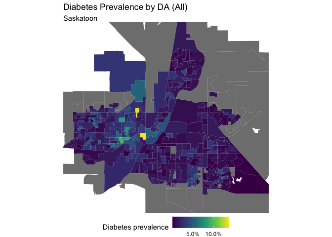
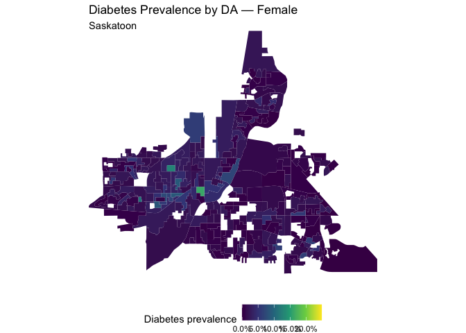
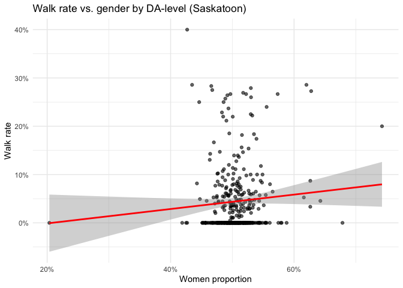

---
output:
  html_document:
    keep_md: true
---

# PLOS in Saskatoon - Gender-based analysis and Correlation with Diabetes

## 1. Gender proportion by DA


``` r
library(cancensus)
library(dplyr)
```

```
## 
## Attaching package: 'dplyr'
```

```
## The following objects are masked from 'package:stats':
## 
##     filter, lag
```

```
## The following objects are masked from 'package:base':
## 
##     intersect, setdiff, setequal, union
```

``` r
library(sf)
```

```
## Linking to GEOS 3.13.0, GDAL 3.8.5, PROJ 9.5.1; sf_use_s2() is TRUE
```

``` r
library(stringr)
library(purrr)
library(RColorBrewer)
library(ggplot2)
library(scales)
```

```
## 
## Attaching package: 'scales'
```

```
## The following object is masked from 'package:purrr':
## 
##     discard
```

``` r
library(readxl)
library(tidyr)
library(stats)

dataset <- "CA21"
```

No vectors with only sex or gender at DA-level, so I will add up the male/female age groups. 


``` r
vecs <- c(
  total      = "v_CA21_1",
  male_0_14  = "v_CA21_12",
  fem_0_14   = "v_CA21_13",
  male_15_64 = "v_CA21_69",
  fem_15_64  = "v_CA21_70",
  male_65p   = "v_CA21_252",
  fem_65p    = "v_CA21_253"
)
```


``` r
sex_da_raw <- get_census(
  dataset    = "CA21",
  regions    = list(CMA = "47725"),
  level      = "DA",
  vectors    = unname(vecs),
  geo_format = NA, # only data frame
  use_cache  = TRUE
)
```

```
## Reading vectors data from local cache.
```

Standardizing names to raw vector IDs (since the actual vector names are longer and turns up an error) -> dropping the labels after the colon. 


``` r
sex_da_std <- sex_da_raw %>%
  rename(DAUID = GeoUID) %>%
  rename_with(~ sub("^((v_CA21_\\d+)).*$", "\\1", .x))
```

Building totals & proportions:


``` r
sex_da <- sex_da_std %>%
  transmute(
    DAUID       = as.character(DAUID),
    total       = as.numeric(.data[[vecs["total"]]]),
    male_total  = as.numeric(.data[[vecs["male_0_14"]]])  +
                  as.numeric(.data[[vecs["male_15_64"]]]) +
                  as.numeric(.data[[vecs["male_65p"]]]),
    fem_total   = as.numeric(.data[[vecs["fem_0_14"]]])   +
                  as.numeric(.data[[vecs["fem_15_64"]]])  +
                  as.numeric(.data[[vecs["fem_65p"]]])
  ) %>%
  mutate(
    prop_men   = if_else(total > 0, male_total / total, NA_real_),
    prop_women = if_else(total > 0, fem_total  / total, NA_real_)
  )

sex_da
```

```
## # A tibble: 449 × 6
##    DAUID    total male_total fem_total prop_men prop_women
##    <chr>    <dbl>      <dbl>     <dbl>    <dbl>      <dbl>
##  1 47110021   720        360       350    0.5        0.486
##  2 47110022   344        160       180    0.465      0.523
##  3 47110027   519        260       265    0.501      0.511
##  4 47110028   397        220       180    0.554      0.453
##  5 47110029   364        185       190    0.508      0.522
##  6 47110030   595        290       305    0.487      0.513
##  7 47110031   492        255       235    0.518      0.478
##  8 47110032   236        120       125    0.508      0.530
##  9 47110033   437        195       245    0.446      0.561
## 10 47110035   418        195       220    0.467      0.526
## # ℹ 439 more rows
```

Summary of sex by DA:


``` r
summary(sex_da$prop_women)
```

```
##    Min. 1st Qu.  Median    Mean 3rd Qu.    Max.    NA's 
##  0.2036  0.4866  0.5025  0.5037  0.5187  0.7425       4
```

``` r
summary(sex_da$prop_men)
```

```
##    Min. 1st Qu.  Median    Mean 3rd Qu.    Max.    NA's 
##  0.2552  0.4806  0.4982  0.4968  0.5147  0.8044       4
```

## 2. Mapping sex by DA


``` r
# plos code
ped_path <- "/Users/patysalazar/Desktop/MSc/PLOS/plos/required_files/Saskatoon_ped_1.shp"
da_path <- "/Users/patysalazar/Desktop/MSc/PLOS/plos/required_files/lda_000b21a_e/lda_000b21a_e.shp"

ped <- st_read(ped_path, quiet = TRUE)
da_poly <- st_read(da_path, quiet = TRUE) |>
  select(DAUID, PRUID, geometry) |>
  filter(PRUID == "47")  

ped <- st_transform(ped, crs = 3857) 
da_poly <- st_transform(da_poly, crs = 3857)

ped <- ped |>
  mutate(
    Walk_Width = ifelse(Walk_Width %in% c("99999", 99999, "<Null>"), NA, Walk_Width) |> as.numeric(),
    Walk_Mater = ifelse(Walk_Mater %in% c("<Null>", "0", 0, "9", 9), NA, Walk_Mater) |> as.integer()
  )

score_type <- function(x){
  case_when(
    x == "Walkway"  ~ 3,
    x == "Separate" ~ 3,
    x == "Pathway"  ~ 2,
    x == "Combined" ~ 1,
    TRUE            ~ 1
  )
}

score_width <- function(w){
  case_when(
    is.na(w)  ~ 0,
    w <  1    ~ 0,
    w <  1.5  ~ 1,
    w <  2.5  ~ 2,
    w <  3    ~ 3,
    TRUE      ~ 4
  )
}

score_material <- function(c){
  case_when(
    c %in% c(1, 2, 10) ~ 3,            
    c %in% c(3, 4)     ~ 2,            
    c %in% c(5, 7)     ~ 1,            
    c == 6 | is.na(c)  ~ 0,            
    TRUE               ~ 0
  )
}

ped_scored <- ped |>
  mutate(
    sc_type  = score_type(Walk_Type_),           
    sc_width = score_width(Walk_Width),
    sc_mat   = score_material(Walk_Mater),
    q_score  = sc_type + sc_width + sc_mat,      
    seg_km   = SHAPE_Leng / 1000,                
    wtd_val  = q_score * seg_km,
    density  = wtd_val / (LANDAREA)        
  )

da_scores <- ped_scored |>
  st_drop_geometry() |>
  group_by(DAUID) |>
  summarise(plos_density = sum(density, na.rm = TRUE), .groups = "drop")
```

DA IDs used in PLOS analysis


``` r
keep_ids <- as.character(unique(da_scores$DAUID))
```

Getting DA polygons from Saskatoon CMA


``` r
das_cma_raw <- get_census(
  dataset    = "CA21",
  regions    = list(CMA = "47725"),
  level      = "DA",
  geo_format = "sf",
  use_cache  = TRUE
)
```

```
## Reading geo data from local cache.
```


``` r
names(das_cma_raw)
```

```
##  [1] "Shape Area"    "Type"          "Households"    "Quality Flags"
##  [5] "name"          "GeoUID"        "CSD_UID"       "Population"   
##  [9] "CT_UID"        "Dwellings"     "CD_UID"        "CMA_UID"      
## [13] "geometry"
```

Target CRS = whatever ped is in (3857) -> aligning CRS


``` r
target_crs <- st_crs(ped)
```

Make sure the DA layer is in the same CRS


``` r
das_cma <- das_cma_raw %>%
  mutate(DAUID = as.character(.data[["GeoUID"]])) |>
  st_transform(target_crs)
```

Keep only DAs analyzed


``` r
das_keep <- das_cma %>% filter(DAUID %in% keep_ids)
```

Join sex proportions 


``` r
gender_keep <- das_keep %>%
  left_join(sex_da, by = "DAUID") %>%
  st_transform(target_crs)
```

Build bbox from the ped layer


``` r
bbox_sask_sf <- st_as_sfc(st_bbox(ped))  
```

Crop


``` r
gender_keep <- st_make_valid(gender_keep) # fix any invalid geometries
gender_keep <- st_crop(gender_keep, bbox_sask_sf)
```

```
## Warning: attribute variables are assumed to be spatially constant throughout
## all geometries
```

Plot 


``` r
gender_da_map <- ggplot(gender_keep) +
  geom_sf(aes(fill = prop_women), color = NA) +
  scale_fill_distiller(
    type = "div", palette = "Reds", direction = -1,
    limits = c(0.40, 0.60), oob = squish,
    labels = percent_format(accuracy = 1),
    name = "Women (%)"
  ) +
  coord_sf(xlim = st_bbox(ped)[c("xmin","xmax")],
           ylim = st_bbox(ped)[c("ymin","ymax")],
           expand = FALSE) +
  labs(title = "Proportion of Women by Dissemination Area",
       subtitle = "Saskatoon",
       caption = "Data: Statistics Canada, Census 2021 (Sex at birth)") +
  theme_void() +
  theme(legend.position = "bottom")

gender_da_map
```

<!-- -->

``` r
ggsave("/Users/patysalazar/Desktop/Methods Café/Final Paper/plos_project/maps/gender_da_map.png",
       plot = gender_da_map, width = 8, height = 6, dpi = 300,
       bg = "white")
```

## 3. Mapping diabetes data (by DA and gender)


``` r
health_data_path <- "/Users/patysalazar/Desktop/Methods Café/Final Paper/plos_project/required_files/Raw data for hospitalizations_for_Paty.xlsx"
```


``` r
health_data <- read_excel(
  path = health_data_path,
  sheet = "Diabetes"  
)

names(health_data)
```

```
##  [1] "year"                     "discharge"               
##  [3] "gender"                   "age"                     
##  [5] "10_yr_groupings"          "registered_indian_status"
##  [7] "pcode"                    "neighbourhood_number"    
##  [9] "neighbourhood_name"       "disparity_nhd_type"      
## [11] "da"                       "Total Dep Local"         
## [13] "SumOfseps"                "MRD"
```

Renaming da to DAUID


``` r
health_data <- health_data %>%
  mutate(da = as.character(da)) %>%
  rename(DAUID = da)
```

Overall cases by DA


``` r
cases_da <- health_data %>%
  group_by(DAUID) %>%
  summarise(cases_all = n())

cases_da_sex <- health_data %>%
  filter(gender %in% c("Male","Female")) %>%
  count(DAUID, gender, name = "cases") %>%
  ungroup()
```

Overall denominator for prevalence (per DA)


``` r
den_all <- sex_da %>% select(DAUID, pop_all = total)
```

Sex-specific denominator for prevalence (per DA)


``` r
den_sex <- sex_da %>%
  transmute(
    DAUID,
    Male   = male_total,
    Female = fem_total
  ) %>%
  pivot_longer(c(Male, Female), names_to="gender", values_to="pop")
```

Overall prevalence by DA


``` r
prev_da <- cases_da %>%
  left_join(den_all, by = "DAUID") %>%
  mutate(prev_all = if_else(pop_all > 0, cases_all / pop_all, NA_real_))

prev_da
```

```
## # A tibble: 344 × 4
##    DAUID    cases_all pop_all prev_all
##    <chr>        <int>   <dbl>    <dbl>
##  1 47110021        10     720  0.0139 
##  2 47110022         2     344  0.00581
##  3 47110027         3     519  0.00578
##  4 47110028         3     397  0.00756
##  5 47110029         2     364  0.00549
##  6 47110030         3     595  0.00504
##  7 47110031         7     492  0.0142 
##  8 47110032         3     236  0.0127 
##  9 47110033         3     437  0.00686
## 10 47110035        17     418  0.0407 
## # ℹ 334 more rows
```

Sex-specific prevalence by DA


``` r
prev_da_sex <- cases_da_sex %>%
  left_join(den_sex, by = c("DAUID","gender")) %>%
  mutate(prev = if_else(pop > 0, cases / pop, NA_real_))

prev_da_sex
```

```
## # A tibble: 620 × 5
##    DAUID    gender cases   pop    prev
##    <chr>    <chr>  <int> <dbl>   <dbl>
##  1 47110021 Female     7   350 0.02   
##  2 47110021 Male       3   360 0.00833
##  3 47110022 Female     2   180 0.0111 
##  4 47110027 Male       3   260 0.0115 
##  5 47110028 Female     3   180 0.0167 
##  6 47110029 Male       2   185 0.0108 
##  7 47110030 Female     1   305 0.00328
##  8 47110030 Male       2   290 0.00690
##  9 47110031 Female     7   235 0.0298 
## 10 47110032 Male       3   120 0.025  
## # ℹ 610 more rows
```

Joining datasets by DA


``` r
da_diabetes <- das_keep %>%
  left_join(health_data, by = "DAUID") 
```

Overall prevalence map


``` r
da_diabetes_all <- das_keep %>%
  left_join(prev_da, by = "DAUID")

da_diabetes_plot <- ggplot(da_diabetes_all) +
  geom_sf(aes(fill = prev_all), color = NA) +
  scale_fill_viridis_c(labels = percent_format(accuracy = 0.1),
                       name = "Diabetes prevalence") +
  coord_sf(
    xlim = st_bbox(ped)[c("xmin","xmax")],
    ylim = st_bbox(ped)[c("ymin","ymax")],
    expand = FALSE
  ) +
  labs(title = "Diabetes Prevalence by DA (All)",
       subtitle = "Saskatoon") +
  theme_void() + theme(legend.position = "bottom")

ggsave("/Users/patysalazar/Desktop/Methods Café/Final Paper/plos_project/maps/diabetes_da_map.png",
       plot = da_diabetes_plot, width = 8, height = 6, dpi = 300,
       bg = "white")

da_diabetes_plot
```

<!-- -->

Sex-specific maps

Splitting into 2 datasets


``` r
# keep only male/female rows from sex-specific prevalence sf
da_diabetes_sex <- das_keep %>%                # <-- sf with geometry
  left_join(prev_da_sex, by = "DAUID") %>% # attach prev + gender
  st_make_valid()     

# common limits across both maps 
lims <- range(da_diabetes_sex$prev, na.rm = TRUE)
lims[1] <- 0
lims[2] <- max(lims[2], 0.15)   # 15% cap

# split
da_diabetes_male   <- da_diabetes_sex %>% filter(gender == "Male")
da_diabetes_female <- da_diabetes_sex %>% filter(gender == "Female")
```

Male map (diabetes by DA)


``` r
p_male <- ggplot(da_diabetes_male) +
  geom_sf(aes(fill = prev), color = NA) +
  scale_fill_viridis_c(
    limits = lims, oob = squish,
    labels = percent_format(accuracy = 0.1),
    name = "Diabetes prevalence",
    na.value = "grey80"  
  ) +
  coord_sf(
    xlim = st_bbox(ped)[c("xmin","xmax")],
    ylim = st_bbox(ped)[c("ymin","ymax")],
    expand = FALSE
  ) +
  labs(
    title = "Diabetes Prevalence by DA — Male",
    subtitle = "Saskatoon"
  ) +
  theme_void() +
  theme(legend.position = "bottom")

print(p_male)
```

<!-- -->

``` r
ggsave("/Users/patysalazar/Desktop/Methods Café/Final Paper/plos_project/maps/male_diabetes_da_map.png",
       plot = p_male, width = 8, height = 6, dpi = 300,
       bg = "white")
```

Female map (diabetes by DA)


``` r
p_female <- ggplot(da_diabetes_female) +
  geom_sf(aes(fill = prev), color = NA) +
  scale_fill_viridis_c(
    limits = lims, oob = squish,
    labels = percent_format(accuracy = 0.1),
    name = "Diabetes prevalence",
    na.value = "grey80"
  ) +
  coord_sf(
    xlim = st_bbox(ped)[c("xmin","xmax")],
    ylim = st_bbox(ped)[c("ymin","ymax")],
    expand = FALSE
  ) +
  labs(
    title = "Diabetes Prevalence by DA — Female",
    subtitle = "Saskatoon"
  ) +
  theme_void() +
  theme(legend.position = "bottom")

print(p_female)
```

<!-- -->

``` r
ggsave("/Users/patysalazar/Desktop/Methods Café/Final Paper/plos_project/maps/female_diabetes_da_map.png",
       plot = p_female, width = 8, height = 6, dpi = 300,
       bg = "white")
```


## 4. Correlation analysis


``` r
# walk scores code
final_data_path <- "/Users/patysalazar/Desktop/MSc/PLOS/plos/required_files/FINAL.xlsx"

final_scores <- read_excel(final_data_path) |>
  mutate(DAUID = as.character(DAUID))

names(final_scores)
```

```
## [1] "DAUID"        "plos_density" "plos_class"   "walk_rate"
```

Analysis data frame


``` r
analysis_df <- final_scores %>%               
  select(DAUID, walk_rate, plos_density) %>%
  left_join(sex_da %>% select(DAUID, prop_women, total), by = "DAUID") %>%
  left_join(prev_da %>% select(DAUID, prev_all), by = "DAUID") %>%  
  mutate(
    plos_z        = as.numeric(scale(plos_density)),
    women_pct     = prop_women * 100
  )
summary(analysis_df)
```

```
##     DAUID             walk_rate        plos_density         prop_women    
##  Length:371         Min.   :0.00000   Min.   :  0.05955   Min.   :0.2036  
##  Class :character   1st Qu.:0.00000   1st Qu.:140.48819   1st Qu.:0.4886  
##  Mode  :character   Median :0.00000   Median :181.99911   Median :0.5046  
##                     Mean   :0.04428   Mean   :167.63210   Mean   :0.5063  
##                     3rd Qu.:0.06061   3rd Qu.:208.61714   3rd Qu.:0.5216  
##                     Max.   :0.40000   Max.   :275.64679   Max.   :0.7425  
##                                                           NA's   :2       
##      total           prev_all            plos_z          women_pct    
##  Min.   :   0.0   Min.   :0.000119   Min.   :-2.8900   Min.   :20.36  
##  1st Qu.: 425.0   1st Qu.:0.007509   1st Qu.:-0.4681   1st Qu.:48.86  
##  Median : 508.0   Median :0.013444   Median : 0.2478   Median :50.46  
##  Mean   : 720.0   Mean   :0.018506   Mean   : 0.0000   Mean   :50.63  
##  3rd Qu.: 678.5   3rd Qu.:0.024436   3rd Qu.: 0.7068   3rd Qu.:52.16  
##  Max.   :9273.0   Max.   :0.138211   Max.   : 1.8628   Max.   :74.25  
##                   NA's   :45                           NA's   :2
```

Correlation walk rate & plos


``` r
cor(final_scores$plos_density, final_scores$walk_rate)
```

```
## [1] 0.1534923
```

Small positive correlation -> areas with better pedestrian infrastructure tend to have slightly higher walk rates, but it's weak.

Correlation walk rate & gender


``` r
cor(analysis_df$prop_women, analysis_df$walk_rate, use = "complete.obs")
```

```
## [1] 0.07866567
```

Weak correlation: 0.079.

Walk rate ~ gender model 


``` r
# unweigthed
m0 <- lm(walk_rate ~ prop_women, data = analysis_df)
summary(m0)
```

```
## 
## Call:
## lm(formula = walk_rate ~ prop_women, data = analysis_df)
## 
## Residuals:
##      Min       1Q   Median       3Q      Max 
## -0.07017 -0.04416 -0.03666  0.01474  0.36733 
## 
## Coefficients:
##             Estimate Std. Error t value Pr(>|t|)
## (Intercept) -0.03095    0.05006  -0.618    0.537
## prop_women   0.14905    0.09860   1.512    0.131
## 
## Residual standard error: 0.07081 on 367 degrees of freedom
##   (2 observations deleted due to missingness)
## Multiple R-squared:  0.006188,	Adjusted R-squared:  0.00348 
## F-statistic: 2.285 on 1 and 367 DF,  p-value: 0.1315
```

Each 1.0 increase in the proportion of women is associated with a 0.15 increase in walk rate, but the association is not statistically significant.


``` r
# weighted by DA population
m0w <- lm(walk_rate ~ prop_women, data = analysis_df, weights = total)
summary(m0w)
```

```
## 
## Call:
## lm(formula = walk_rate ~ prop_women, data = analysis_df, weights = total)
## 
## Weighted Residuals:
##     Min      1Q  Median      3Q     Max 
## -2.3838 -0.8449 -0.5827  0.4968  6.9619 
## 
## Coefficients:
##             Estimate Std. Error t value Pr(>|t|)  
## (Intercept) -0.03932    0.04352  -0.903   0.3669  
## prop_women   0.15122    0.08531   1.773   0.0771 .
## ---
## Signif. codes:  0 '***' 0.001 '**' 0.01 '*' 0.05 '.' 0.1 ' ' 1
## 
## Residual standard error: 1.656 on 367 degrees of freedom
##   (2 observations deleted due to missingness)
## Multiple R-squared:  0.008489,	Adjusted R-squared:  0.005788 
## F-statistic: 3.142 on 1 and 367 DF,  p-value: 0.07712
```

Slightly stronger when weighted by population, suggesting that larger DAs might show a clearer relationship between gender composition and walk rate. Almost statistically significant. 

Scatterplot


``` r
ggplot(analysis_df, aes(x = prop_women, y = walk_rate)) +
  geom_point(alpha = 0.6) +
  geom_smooth(method = "lm", se = TRUE, color = "red") +
  scale_x_continuous(labels = percent_format(accuracy = 1)) +
  scale_y_continuous(labels = percent_format(accuracy = 1)) +
  labs(
    x = "Women proportion",
    y = "Walk rate",
    title = "Walk rate vs. gender by DA-level (Saskatoon)"
  ) +
  theme_minimal()
```

```
## `geom_smooth()` using formula = 'y ~ x'
```

```
## Warning: Removed 2 rows containing non-finite outside the scale range
## (`stat_smooth()`).
```

```
## Warning: Removed 2 rows containing missing values or values outside the scale range
## (`geom_point()`).
```

<!-- -->

Diabetes correlations


``` r
cor(analysis_df$walk_rate, analysis_df$prev_all, use = "complete.obs", method = "spearman")
```

```
## [1] 0.07684773
```

``` r
cor(analysis_df$plos_density, analysis_df$prev_all, use = "complete.obs", method = "spearman")
```

```
## [1] -0.08210738
```


