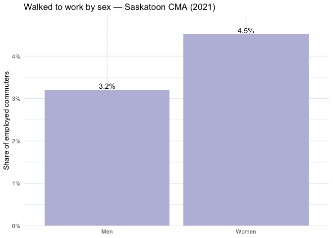

---
output:
  html_document:
    keep_md: true
---

# Walk Rate by Sex - Saskatoon 2021


``` r
# Load the required Libraries
library(sf)
```

```
## Linking to GEOS 3.13.0, GDAL 3.8.5, PROJ 9.5.1; sf_use_s2() is TRUE
```

``` r
library(dplyr)
```

```
## 
## Attaching package: 'dplyr'
```

```
## The following objects are masked from 'package:stats':
## 
##     filter, lag
```

```
## The following objects are masked from 'package:base':
## 
##     intersect, setdiff, setequal, union
```

``` r
library(readr)
library(ggplot2)
library(readxl)
library(cancensus)
library(tidyr)
library(stringr)
library(purrr)
library(units)
```

```
## udunits database from /Library/Frameworks/R.framework/Versions/4.5-x86_64/Resources/library/units/share/udunits/udunits2.xml
```

``` r
library(rlang)
```

```
## 
## Attaching package: 'rlang'
```

```
## The following objects are masked from 'package:purrr':
## 
##     %@%, flatten, flatten_chr, flatten_dbl, flatten_int, flatten_lgl,
##     flatten_raw, invoke, splice
```

``` r
library(scales)
```

```
## 
## Attaching package: 'scales'
```

```
## The following object is masked from 'package:purrr':
## 
##     discard
```

```
## The following object is masked from 'package:readr':
## 
##     col_factor
```

``` r
options(cancensus.use_cache = TRUE)
```

## 0. Credential & file paths


``` r
#set_cancensus_api_key('CensusMapper_a1e87e6e693ad90764c0b852462913c1', install = TRUE)
#set_cancensus_cache_path("/Users/patysalazar/Desktop/Methods Café/Final Paper/cancensus_cache", install = TRUE) 
```


``` r
plos_csv <- "/Users/patysalazar/Desktop/MSc/PLOS/plos/required_files/sk_da_plos_score.csv"
plos_seg_csv <- "/Users/patysalazar/Desktop/MSc/PLOS/plos/required_files/sk_segment_plos.csv"
```

## 1. Region and dataset

CMA 47725 -> Saskatoon
CA21 -> 2021 census data


``` r
dataset <- "CA21"
region <- list(CMA = "47725")
```

Searching for vectors that I want to examine


``` r
find_census_vectors("Main mode of commuting", dataset="CA21") %>%
  print(n=24)
```

```
## # A tibble: 24 × 4
##    vector      type   label                                              details
##    <chr>       <fct>  <chr>                                              <chr>  
##  1 v_CA21_7632 Total  Total - Main mode of commuting for the employed l… 25% Da…
##  2 v_CA21_7633 Male   Total - Main mode of commuting for the employed l… 25% Da…
##  3 v_CA21_7634 Female Total - Main mode of commuting for the employed l… 25% Da…
##  4 v_CA21_7635 Total  Car, truck or van                                  25% Da…
##  5 v_CA21_7636 Male   Car, truck or van                                  25% Da…
##  6 v_CA21_7637 Female Car, truck or van                                  25% Da…
##  7 v_CA21_7638 Total  Car, truck or van - as a driver                    25% Da…
##  8 v_CA21_7639 Male   Car, truck or van - as a driver                    25% Da…
##  9 v_CA21_7640 Female Car, truck or van - as a driver                    25% Da…
## 10 v_CA21_7641 Total  Car, truck or van - as a passenger                 25% Da…
## 11 v_CA21_7642 Male   Car, truck or van - as a passenger                 25% Da…
## 12 v_CA21_7643 Female Car, truck or van - as a passenger                 25% Da…
## 13 v_CA21_7644 Total  Public transit                                     25% Da…
## 14 v_CA21_7645 Male   Public transit                                     25% Da…
## 15 v_CA21_7646 Female Public transit                                     25% Da…
## 16 v_CA21_7647 Total  Walked                                             25% Da…
## 17 v_CA21_7648 Male   Walked                                             25% Da…
## 18 v_CA21_7649 Female Walked                                             25% Da…
## 19 v_CA21_7650 Total  Bicycle                                            25% Da…
## 20 v_CA21_7651 Male   Bicycle                                            25% Da…
## 21 v_CA21_7652 Female Bicycle                                            25% Da…
## 22 v_CA21_7653 Total  Other method                                       25% Da…
## 23 v_CA21_7654 Male   Other method                                       25% Da…
## 24 v_CA21_7655 Female Other method                                       25% Da…
```

Selecting vectors by gender:

v_CA21_7633 -> Main mode of commuting for the employed labour force aged 15 years and over with a usual place of work or no fixed workplace address — Male
v_CA21_7634 -> Main mode of commuting for the employed labour force aged 15 years and over with a usual place of work or no fixed workplace address — Female
v_CA21_7648 -> Walked — Male
v_CA21_7649 -> Walked — Female

Declaring the exact census vectors I want:


``` r
ids <- c(
  total_m = "v_CA21_7633",  
  total_f = "v_CA21_7634",  
  walk_m  = "v_CA21_7648", 
  walk_f  = "v_CA21_7649"   
)
```

## 2. Pulling the data at CMA level (Saskatoon):


``` r
cma <- get_census(
  dataset   = dataset,
  regions   = region,
  level     = "CMA",
  geo_format = "sf",
  use_cache = TRUE,
  vectors   = unname(ids)
)
```

```
## Reading vectors data from local cache.
```

```
## Reading geo data from local cache.
```

## 3. Normalizing column names (vector IDs)


``` r
names(cma) <- ifelse(grepl("^v_CA21_\\d+", names(cma)),
                     sub("^((v_CA21_\\d+)).*$", "\\1", names(cma)),
                     names(cma))

# stripping off labels, leaving id
```

## 4. Computing walk rates by sex:


``` r
out <- cma %>%
  st_drop_geometry() %>%
  mutate(
    region_name = dplyr::coalesce(.data[["Region Name"]], .data[["name"]]),
    total_m = .data[["v_CA21_7633"]],
    total_f = .data[["v_CA21_7634"]],
    walk_m  = .data[["v_CA21_7648"]],
    walk_f  = .data[["v_CA21_7649"]],
    rate_walk_m = if_else(total_m > 0, walk_m / total_m, NA_real_),
    rate_walk_f = if_else(total_f > 0, walk_f / total_f, NA_real_)
  ) %>%
  select(region_name, total_m, total_f, walk_m, walk_f, rate_walk_m, rate_walk_f)

print(out)
```

```
##     region_name total_m total_f walk_m walk_f rate_walk_m rate_walk_f
## 1 Saskatoon (B)   69315   61285   2220   2765   0.0320277  0.04511708
```

## 5. Plotting bar chart (men vs women)


``` r
plot_df <- out %>%
  pivot_longer(c(rate_walk_f, rate_walk_m),
               names_to = "sex", values_to = "rate") %>%
  
  # reshaping the rate columns into one column for easier plotting
  
  mutate(sex = recode(sex,
                      rate_walk_f = "Women",
                      rate_walk_m = "Men"))

ggplot(plot_df, aes(sex, rate)) +
  geom_col(fill="#bcbddc") +
  geom_text(aes(label = percent(rate, accuracy = 0.1)),
            vjust = -0.3) +
  scale_y_continuous(labels = percent_format(accuracy = 1),
                     expand = expansion(mult = c(0, 0.1))) +
  labs(
    title = "Walked to work by sex — Saskatoon CMA (2021)",
    x = NULL,
    y = "Share of employed commuters"
  ) +
  theme_minimal()
```

<!-- -->


